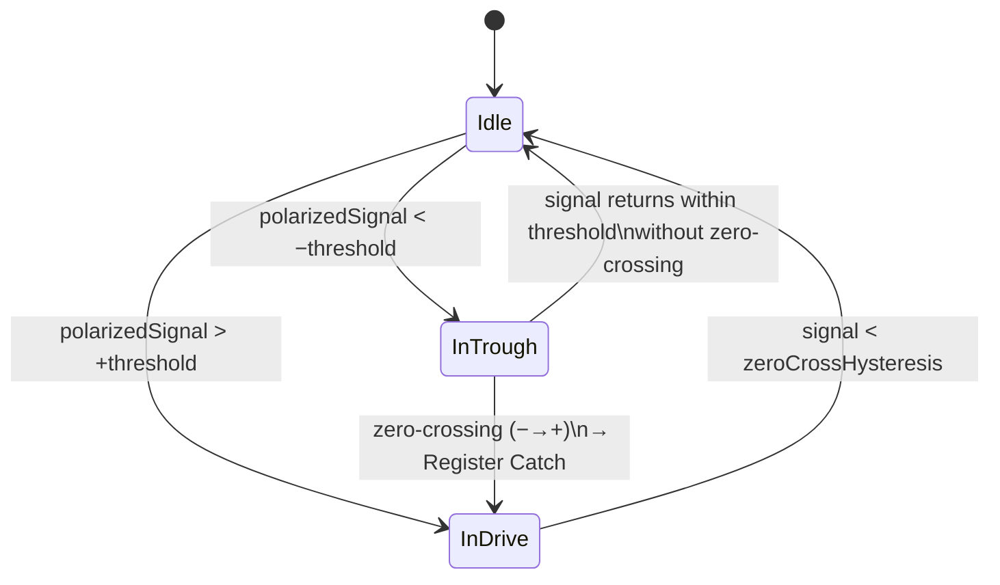

# RowPilot Stroke Rate Detection Architecture

### Overview
RowPilot measures stroke rate (SPM — Strokes Per Minute) using the iPhone's built-in accelerometer, requiring no external hardware.
The algorithm is inspired by peer-reviewed rowing biomechanics research and established commercial implementations, and is designed to work regardless of how the phone is mounted on the boat.

---

## 1. Physical Principle
### Boat Acceleration Pattern
During a rowing stroke cycle, the boat's longitudinal (forward) acceleration follows a characteristic waveform:

| Phase | Acceleration |
|---|---|
| Drive (catch → finish) | **Positive** — Blade in water, boat accelerates |
| Recovery (finish → catch) | **Negative** — Rower's body moves forward, boat decelerates |

The **catch** — the moment the blade enters the water and drive begins — corresponds to the transition from a negative trough to a positive phase (negative-to-positive zero-crossing).

### References
- **CrewNerd** (performancephones.com): Monitors characteristic patterns in horizontal boat acceleration to detect the catch
- **NK SpeedCoach**: Identifies the "negative peak (minimum)" at the recovery-to-drive transition
- **Academic research** (Rowing in Motion / RUG): Uses zero-crossings after low-pass filtering to classify catch and finish
- **Open Rowing Monitor** (github.com/laberning/openrowingmonitor): Manages drive/recovery phases via a finite state machine

---

## 2. Sensor Configuration
### Device Motion (CMMotionManager)
RowPilot uses Apple's `CMMotionManager` with device motion updates (gravity-corrected acceleration) rather than raw accelerometer data.

- **Sampling Rate**: **50 Hz** (20ms interval)
- **Data Type**: `userAcceleration` — linear acceleration with gravity removed

### Dynamic Axis Selection
Since the phone can be mounted in any orientation, RowPilot does not assume a fixed axis. Instead, it continuously tracks the exponential moving average (EMA) of signal amplitude on all three axes and selects the most active one.

```
α = 0.01  (time constant ≈ 2 seconds at 50 Hz)
varianceX = varianceX × (1 − α) + |accel.x| × α
varianceY = varianceY × (1 − α) + |accel.y| × α
varianceZ = varianceZ × (1 − α) + |accel.z| × α

activeAxis = argmax(varianceX, varianceY, varianceZ)
```

This makes the detection robust to arbitrary phone mounting directions — horizontal, vertical, or angled.

---

## 3. Signal Processing
### 2nd-Order Butterworth Low-Pass Filter
Raw accelerometer data contains high-frequency noise from water, vibration, and handling. A 2nd-order Butterworth filter suppresses noise above 3 Hz while preserving the stroke-frequency signal (typical rowing: 0.3–1.5 Hz / 18–90 SPM).

#### Filter Specification
| Parameter | Value |
|---|---|
| Filter Type | 2nd-order Butterworth IIR |
| Cutoff Frequency | 3 Hz |
| Sampling Frequency | 50 Hz |
| Design Method | Bilinear transform |

#### Difference Equation
```
y[n] = b0·x[n] + b1·x[n−1] + b2·x[n−2] − a1·y[n−1] − a2·y[n−2]
```

| Coefficient | Value |
|---|---|
| b0 | 0.02008337 |
| b1 | 0.04016673 |
| b2 | 0.02008337 |
| a1 | −1.56101808 |
| a2 | 0.64135154 |

---

## 4. Catch Detection — Finite State Machine
### Overview
The filtered signal is processed by a 3-state finite state machine that tracks the stroke phase and identifies the catch event with sub-sample precision.



### States
| State | Description |
|---|---|
| `Idle` | Signal within threshold; no active stroke phase |
| `InTrough` | Signal has entered the negative trough; tracking minimum |
| `InDrive` | Signal is in the positive drive phase |

### Polarity Auto-Detection
The algorithm automatically determines whether the catch corresponds to a positive or negative acceleration peak depending on how the phone is mounted. The first significant threshold crossing establishes the polarity for the session.

### Parameters
| Parameter | Value | Description |
|---|---|---|
| Catch Threshold | **0.06 G** | Minimum acceleration magnitude to enter a trough |
| Zero-Cross Hysteresis | threshold × 15% | Prevents false triggers near the zero line |

---

## 5. SPM Calculation
### Catch Timestamp — Sub-Sample Precision
The catch is registered at the **timestamp of the trough minimum** (the most negative point), not the zero-crossing. This provides more accurate timing by anchoring to the physical event.

### Median of Recent Intervals
SPM is computed from the **median of the 3 most recent inter-catch intervals**. The median is chosen over the mean because it is robust to outlier intervals caused by missed or false catches.

```
intervals = [t1→t2, t2→t3, t3→t4]    (from last 4 catch timestamps)
medianInterval = median(intervals)
rawSPM = 60.0 / medianInterval
```

Valid interval range: **0.5 s – 6.0 s** (equivalent to 10–120 SPM)

### Exponential Moving Average (EMA) Smoothing
To prevent the displayed SPM from flickering:

```
smoothedSPM = 0.6 × rawSPM + 0.4 × previousSPM
```

The weight of 0.6 on the current value ensures fast response to genuine rate changes while dampening noise.

### Dynamic Debounce
To prevent double-counting within a single stroke, a minimum inter-catch interval is enforced. The debounce window adapts to the current SPM:

```
strokePeriod = 60.0 / currentSPM
debounce = clamp(strokePeriod × 0.45, min: 0.4s, max: 2.0s)
```

This allows the algorithm to accurately track high stroke rates (e.g., race start at 40+ SPM) without false rejections.

---

## 6. System Summary

```
CMDeviceMotion (50 Hz)
        │
        ▼
  Dynamic Axis Selection
  (EMA-based, orientation-agnostic)
        │
        ▼
  2nd-Order Butterworth LPF
  (fc = 3 Hz, noise rejection)
        │
        ▼
  3-State Finite State Machine
  (Idle → InTrough → InDrive)
        │
        ▼
  Catch Event (at trough minimum)
        │
        ▼
  Dynamic Debounce Filter
        │
        ▼
  Median of Last 3 Intervals → EMA Smoothing
        │
        ▼
  Published SPM (Int, rounded)
```

---

## 7. Privacy & Hardware Requirements
| Item | Detail |
|---|---|
| Hardware Required | iPhone accelerometer (built-in) |
| External Sensor | Not required |
| Location | Not required |
| Network | Not required |
| Data Transmission | All processing is on-device; no data leaves the device |

---

<hr>Version: 1.0<br>
Author: Kaito Nakahira / Antigravity AI<br>
Date: 2026-06-25
