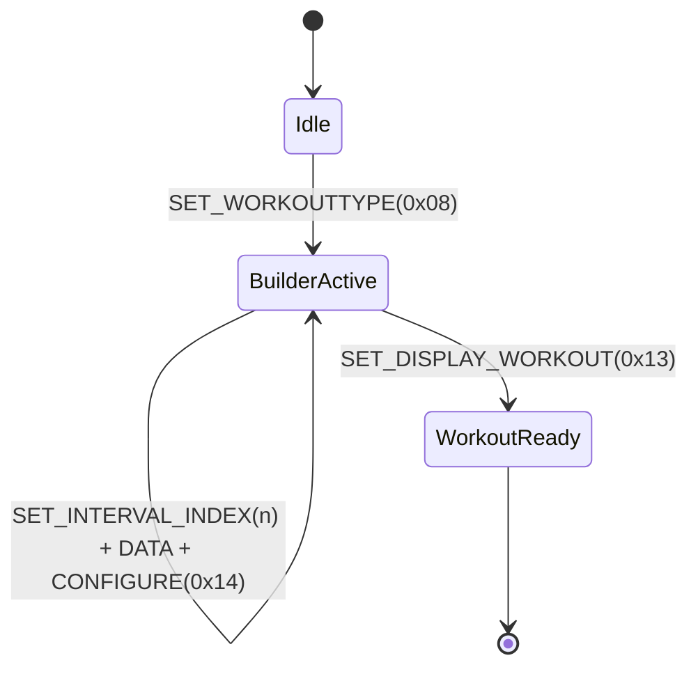

# PM5 Variable Interval Communication Architecture v1

### 1. Executive Summary
This document defines the communication protocol and transaction model for programming Variable Interval workouts on Concept2 PM5 monitors. Unlike standard fixed-distance or fixed-time workouts, Variable Intervals require a stateful, multi-frame transaction to overcome payload limitations and firmware buffer constraints.

---
### 2. Technical Context
#### 2.1 The Problem: Single-Frame Failure
Initial implementations attempted to pack all intervals (Work/Rest pairs) into a single CSAFE frame.

- Confirmed: Up to 4 intervals typically succeed.
- Confirmed: 5 or more intervals consistently fail.
-Observation: The PM5 accepts the packet (checksum passes), and the UI may show a brief loading state, but the workout is never committed. No standard error codes (e.g., 384-1) are returned.

#### 2.2 Payload Size Limit Hypothesis
- Speculation: The PM5 firmware has a restricted input buffer for the SET_HORIZONTAL_DISTANCE (or similar) commands when combined with SET_WORKOUT_TYPE.
- Speculation: There is an internal 64-byte to 128-byte limit on the reassembled CSAFE command buffer before the processing engine triggers a silent overflow or rejection.

---
### 3. Protocol Definition
#### 3.1 Workout Type
Confirmed: WorkoutType = 0x08 designates a Variable Interval workout.
Note: Standard fixed time is 0x01, fixed distance is 0x02.

#### 3.2 Key Commands
Command ID	Name	Role in Variable Intervals

| Command ID | Name | Role in Variable Intervals |
|------------|------|----------------------------|
| 0x01	| SET_WORKOUTTYPE |	Sets context to 0x08. |
| 0x18	| SET_INTERVAL_INDEX | Defines which interval (0-based) is being configured.|
| 0x14	| CONFIGURE_WORKOUT	| Stateful Trigger: Signals the firmware to append/update the current interval builder.
| 0x13 | SET_DISPLAY_WORKOUT | Finalizes the transaction and commits the UI.

---
### 4. Multi-Frame Append Strategy
#### 4.1 The State Machine Hypothesis
We hypothesize that the PM5 firmware operates a "Workout Builder" state machine that remains active as long as the device stays in a configuration phase.



#### 4.2 Why CONFIGURE (0x14) in every frame?
Speculation: The 0x14 command acts as a "Commit Interval" trigger. Without it, the data provided for a specific index may stay in a volatile buffer.
Speculation: It prevents the PM5 from timing out the builder session by proving an active configuration sequence is in progress.

---
### 5. Packet Structure Examples
#### 5.1 Initialization Frame (First Interval)
Sets the workout type and the first interval parameters.

```bash
[Start] F1
[Payload]
  01 01 08 (Workout Type: Variable)
  18 01 00 (Interval Index: 0)
  07 02 EE 02 (Work Distance: 750m)
  08 02 3C 00 (Rest Time: 60s)
  14 00 (Configure/Append)
[End] Checksum + F2
```

#### 5.2 Append Frame (Subsequent Intervals)
Repeats the interval-specific configuration.

```bash
[Start] F1
[Payload]
  18 01 01 (Interval Index: 1)
  07 02 FA 00 (Work Distance: 500m)
  08 02 1E 00 (Rest Time: 30s)
  14 00 (Configure/Append)
[End] Checksum + F2
```
#### 5.3 Finalization Frame
Commits the list to the PM5 screen.

```bash
[Start] F1
[Payload]
  13 00 (Display Workout)
[End] Checksum + F2
```

### 6. Implementation Guidelines (RowPilot Strategy)
#### 1.Frame Splitting:
- Always split each interval into its own CSAFE frame.
- Maximum payload per frame should not exceed 32 bytes of actual CSAFE data to ensure compatibility with BLE MTU and internal PM5 buffers.

#### 2.Sequential Processing:
- Wait for the CSAFE response (Status byte) of Frame N before sending Frame N+1.
- Monitor the status byte for "Busy" flags.
#### 3.Display Delay:
- Only send SET_DISPLAY_WORKOUT (0x13) after the final interval has been successfully "Configured" (0x14). This prevents the UI from trying to render an incomplete workout.
---
### 7. Future Verification & Risks
#### 7.1 Unconfirmed Behaviors
- **Max Limit**: ErgData supports up to 50 intervals. We need to verify if RowPilot's multi-frame strategy holds up to the 50-interval limit or if there is a secondary buffer limit at 20-30 intervals.
- **Inter-frame Gap**: While not strictly required by Bluetooth, a 20-50ms gap between append frames improves reliability on older PM5 hardware.

### 7.2 Safety / Error Handling
If any append frame fails, the entire transaction should be aborted with a RESET_DRIVE or TERMINATE command to prevent a "zombie" builder state in the PM5.

<hr>Version: 1.0<br>
Author: Kaito Nakahira / Antigravity AI<br>
Date: 2026-05-16
